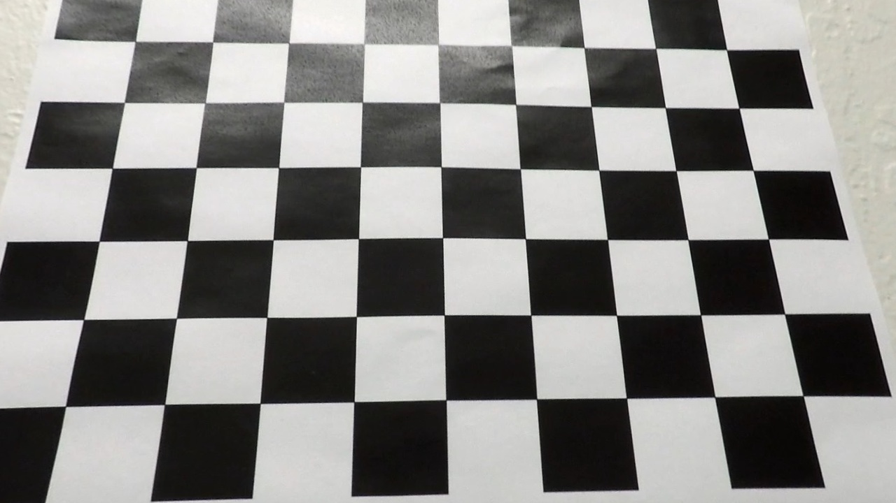

**Advanced Lane Finding Project**

The goals / steps of this project are the following:

* Compute the camera calibration matrix and distortion coefficients given a set of chessboard images.
* Apply a distortion correction to raw images.
* Use color transforms, gradients, etc., to create a thresholded binary image.
* Apply a perspective transform to rectify binary image ("birds-eye view").
* Detect lane pixels and fit to find the lane boundary.
* Determine the curvature of the lane and vehicle position with respect to center.
* Warp the detected lane boundaries back onto the original image.
* Output visual display of the lane boundaries and numerical estimation of lane curvature and vehicle position.

[//]: # (Image References)

[image_origin]: ./camera_cal/origin9.jpg "Undistorted"
[image_undistort]: ./camera_cal/undistort9.jpg "Undistorted"
[image_test_undistort]: ./output_images/undistort.png "Road Transformed"
[image_combo]: ./output_images/combined_binary.png "Binary Example"
[image_select_points]: ./output_images/select_points.png "Warp Example"
[image_perspective]: ./output_images/perspective_transform.png "Fit Visual"
[image_polyfit]: ./output_images/polyfit.png "Output"
[image_output_final]: ./output_images/output_final.png "Output"
output_final

[video1]: ./project_video.mp4 "Video"

## [Rubric](https://review.udacity.com/#!/rubrics/571/view) Points

### Here I will consider the rubric points individually and describe how I addressed each point in my implementation.  

### Writeup / README

#### 1. Provide a Writeup / README that includes all the rubric points and how you addressed each one.  You can submit your writeup as markdown or pdf.  [Here](https://github.com/udacity/CarND-Advanced-Lane-Lines/blob/master/writeup_template.md) is a template writeup for this project you can use as a guide and a starting point.  

### Camera Calibration

#### 1. Briefly state how you computed the camera matrix and distortion coefficients. Provide an example of a distortion corrected calibration image.

The code for this step is contained in the section `Camera calibration` the IPython notebook located in "./advanced_lane_detect.ipynb" 

I start by preparing "object points", which will be the (x, y, z) coordinates of the chessboard corners in the world. Here I am assuming the chessboard is fixed on the (x, y) plane at z=0, such that the object points are the same for each calibration image.  Thus, `objp` is just a replicated array of coordinates, and `objpoints` will be appended with a copy of it every time I successfully detect all chessboard corners in a test image.  `imgpoints` will be appended with the (x, y) pixel position of each of the corners in the image plane with each successful chessboard detection.  

I then used the output `objpoints` and `imgpoints` to compute the camera calibration and distortion coefficients using the `cv2.calibrateCamera()` function.  I applied this distortion correction to the test image using the `cv2.undistort()` function and obtained this result: 
##### Image with distortion

##### Correct distortion with calibration parameter

### Pipeline (single images)

#### 1. Provide an example of a distortion-corrected image.

To demonstrate this step, I will describe how I apply the distortion correction to one of the test images like this one.
![test image after undistort][image_test_undistort]
The function `def undistort_img(img, mtx, dist)` performs this step. `img` is the original image, `mtx` and `dist` are the parameter computed from the calibration step.  
#### 2. Describe how (and identify where in your code) you used color transforms, gradients or other methods to create a thresholded binary image.  Provide an example of a binary image result.

I used a combination of color and gradient thresholds to generate a binary image. These include 
* gradient in x direction 
`def abs_sobel_thresh(img, orient='x', sobel_kernel=3, thresh=(0, 255))`
* magnitude of gradient 
`def mag_thresh(image, sobel_kernel=3, mag_thresh=(0, 255))`
* the orientation of gradient 
`def dir_threshold(image, sobel_kernel=3, thresh=(0, np.pi/2))`
* the L channel of the HLS color space. 
`def hls_select(img, thresh=(0, 255))`

Here's an example of my output for this step.  (note: this is not actually from one of the test images)

![alt text][image_combo]

#### 3. Describe how (and identify where in your code) you performed a perspective transform and provide an example of a transformed image.

The section `Perspective Transformation` include code for transform a image into birdeye perspective. I manually choose 4 points on the test image and map them to a rectangular in the target image. 
This resulted in the following source and destination points:

| Source        | Destination   | 
|:-------------:|:-------------:| 
| 315 , 650      | 315 , 650        | 
| 608 , 440     | 315, -440      |
| 673,  440     | 1000, -440      |
| 1000, 650      | 1000, 650       |

I verified that my perspective transform was working as expected by drawing the `src` and `dst` points onto a test image and its warped counterpart to verify that the lines appear parallel in the warped image.
|![image_selection][image_select_points]|![image_selection][image_perspective]|

#### 4. Describe how (and identify where in your code) you identified lane-line pixels and fit their positions with a polynomial?

The find lane function is defined in `def find_lane( image_warped )`. The input of the function `image_warped` is a binary image after perspective transformation. I first use histogram to find where to begin searching the left and right line. Then I use 9 sliding windows to search from the bottom to the top of the image. And I use second order polynomial to fit all the points which are considered as lane lines. In order to reject outliers, I compute standard deviation of the x coordinate in each window and reject the window where the std is larger than a threshold. In this way I am still able to fit good lane line in some extrem difficult case like the one below

![alt text][image_polyfit]

#### 5. Describe how (and identify where in your code) you calculated the radius of curvature of the lane and the position of the vehicle with respect to center.

I did this in function `def compute_curvature (leftx, lefty, rightx, righty)`. First I fit a new polynomial in world space and then compute the curvature according to the formular 
$$R = \frac{(1+(2Ay + B)^2)^{1.5}}{|2A|}$$, where $$A$$ and $$B$$ are polynomial coefficients.
The position of the vehicle with respect to the lane center is computed by evaluating both the left and right polynomial at the bottom of image. The x coordinate of middle of the lane is then calculated based on the result. By substracting the middle to the half of image width I obtain how many pixels the vehicle is deviate from the center. As the width of lane line is about 3,7 m, I can compute meter/pixel and finally compute the offset from center in meter.

#### 6. Provide an example image of your result plotted back down onto the road such that the lane area is identified clearly.

I implemented this step in function `def inverse_warp(undist,   left_fitx , right_fitx, ploty , Minv)`. The result is shown in the following
![alt text][image_output_final]

---

### Pipeline (video)

#### 1. Provide a link to your final video output.  Your pipeline should perform reasonably well on the entire project video (wobbly lines are ok but no catastrophic failures that would cause the car to drive off the road!).

Here's a [link to my video result](https://youtu.be/BQgybqvYK7o)

---

### Discussion

#### 1. Briefly discuss any problems / issues you faced in your implementation of this project.  Where will your pipeline likely fail?  What could you do to make it more robust?

I also implement the `track_lane_line(image_perpective, left_fit, right_fit )` function so that if a good lane line is already found, search  of lane line pixels can be performed more efficiently. In order to determine the fit is plausible I use three criteria to perform the sanity check. First I compute the width of lane line based on ten different y coordinates, I compare the average of the lane width to 3,7 m. Second, I compute and compare the standard deviation of 10 measurement of lane width. Third, I check whether the curvature radius of left and right line is approximatly equal. If all these criteria are met, the tracking function is used for detection otherwise a new detection will be triggered. 

